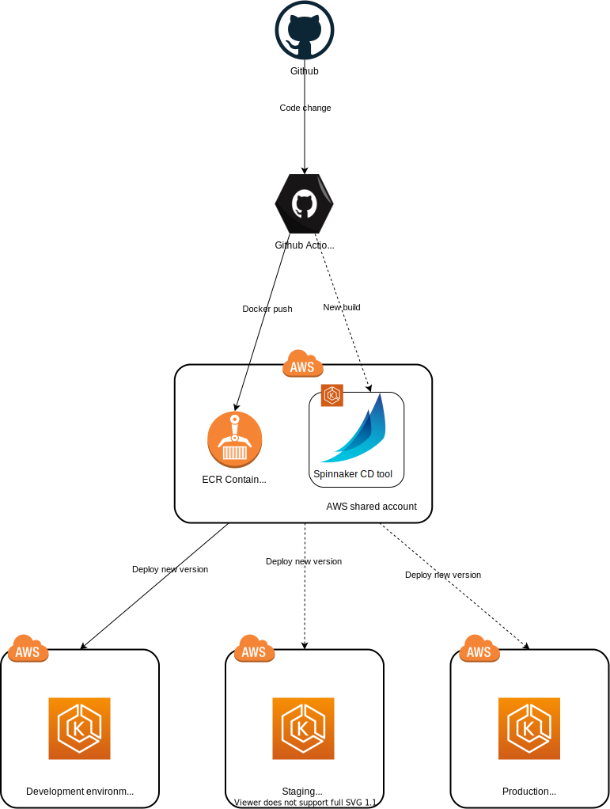

# Continuous Delivery

## What is Continuous Delivery(CD)

The first paragraph from [continuousdeliver.com](https://continuousdelivery.com/#main)

> Continuous Delivery is the ability to get changes of all types—including new features, configuration changes, bug fixes and experiments—into production, or into the hands of users, _safely_ and _quickly_ in a _sustainable_ way.

## Why do CD

Top three reasons:

- Lower risk of changes - By delivering smaller changes to production and exercising the deployment process many times a day, we significantly lower the risk of quality regression or unexpected deployment hurdles.
- Faster time-to-market - We often have emergency applications that need to get deployed in production under quite tight deadlines. Having a safe delivery pipeline makes this possible.
- Higher quality - by running our ever-growing regression test suites after every change in the code, we make sure we do not take a step backwards quality-wise.

## Process overview

## Continuous Integration(CI)

CI is an integral part of the CD. It ensures the quality of the code and packages the assets, making them ready for deployment.

We trigger the CI process for all GitHub Pull Requests targeting the `master` branch without publishing assets. We trigger the CI process and publish the assets when making changes to `master` and `release/**` branches.

We lint the code, check the formatting of the code, perform Node modules vulnerability scan, run the unit and integration tests, run the end-to-end tests(TODO) and finally, if successful, we package the code and assets.

Code and assets from [island.is] are packaged in Docker containers and stored in a private Docker registry hosted in AWS [ECR]. The [ECR] is configured to perform [vulnerability scanning](https://docs.aws.amazon.com/AmazonECR/latest/userguide/image-scanning.html) of all Docker images pushed to it.

When the CI process finishes successfully and has published assets, we trigger the Delivery pipeline.

## Configuration

Our deployment platform is Kubernetes and our applications' deployment and configuration is specified using [Helm]. Additionally, we have the configuration for our infrastructure in AWS specified using [Terraform]. These two configuration sources are hosted in two separate git repositories with restricted access.

## Delivery pipeline

We use [Spinnaker] as a deployment tool for Kubernetes. We have a few application pipelines that are identical for the most part. Each application defined as "emergency" has its own pipeline as well as the umbrella application containing the apps following the standard release cadence.

The pipelines are defined and versioned in Spinnaker. The input to the pipelines consists of two parts:

- Docker image tag - specifies which revision of the code/assets to be deployed
- Helm charts revision number - which revision of the Helm setup and configuration to be used

The [Helm] chart stored in our [Charmuseum] comes in as an asset as well as value files containing environmental specific values. Docker tag, value files and helm chart are baked together creating Kubernetes manifest that can be deployed to a specific environment.

The CI process triggers the pipelines upon a successful build, which automatically deploys to our `Dev` and `Staging` environment.
After manual approval, it is possible to deploy to `Prod` as well.

Our Spinnaker is accessible [here](https://spinnaker.shared.devland.is).

[island.is]: https://github.com/island-is/island.is
[ecr]: https://aws.amazon.com/ecr/
[helm]: https://helm.sh
[terraform]: https://www.terraform.io
[spinnaker]: https://spinnaker.io
[chartmuseum]: https://github.com/helm/chartmuseum
